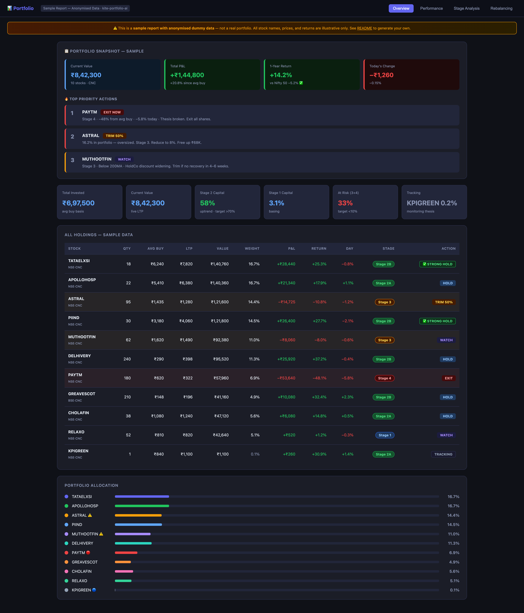
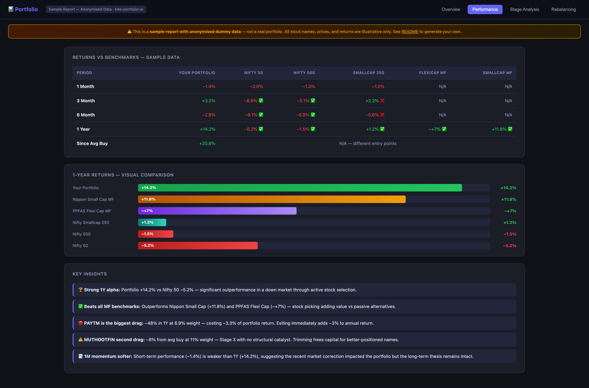
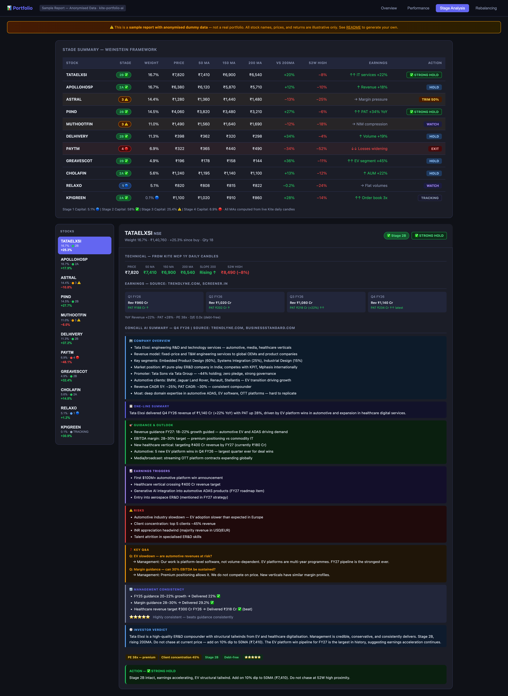
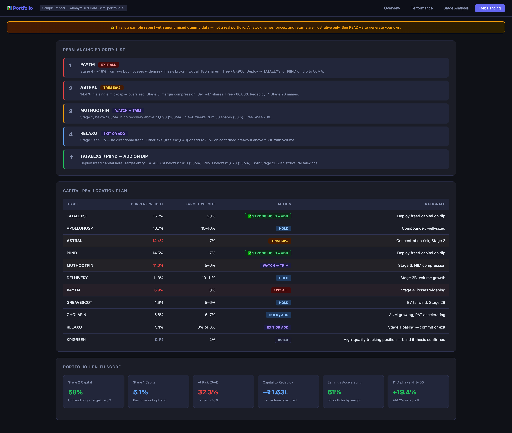

# kite-portfolio-ai

> AI-powered portfolio analysis for Zerodha Kite — fundamentals-first rebalancing, on-demand stock deep-dive, benchmark comparison, concall AI summaries — all in a dark-mode HTML report on your Desktop.

[](https://claude.ai/code)
[](https://modelcontextprotocol.io)
[](https://cursor.sh)
[](https://github.com/features/copilot)
[](LICENSE)

---

## What it does

Run `/portfolio` in Claude Code and get a 5-tab dark-mode report — or run `/kite-portfolio:stock TICKER` for an on-demand institutional-grade deep-dive on any NSE/BSE stock.

| Command | What you get |
|---|---|
| `/portfolio` | Shows sub-skill menu |
| `/kite-portfolio:performance` | Module 1 only — benchmark comparison (1M/3M/6M/1Y vs Nifty 50/500/Smallcap/MFs) |
| `/kite-portfolio:stage` | Module 2 only — stage classification + fundamentals-first rebalancing |
| `/kite-portfolio:full` | Full 5-tab report: Overview · Performance · Stage Analysis · Rebalancing · Stock Analyser |
| `/kite-portfolio:stock TICKER` | On-demand deep-dive for any NSE/BSE stock — 8 sections, score card, bull/base/bear cases |

### Portfolio Report Tabs

| Tab | Content |
|---|---|
| **Overview** | Snapshot, holdings table, allocation chart, today's change, Stage 2 / at-risk capital |
| **Performance** | 1M/3M/6M/1Y returns vs Nifty 50, Nifty 500, Smallcap 250, Flexicap MF, Smallcap MF |
| **Stage Analysis** | Weinstein stage per stock + 13-section concall AI summary + management credibility ⭐ |
| **Rebalancing** | Priority list with **0–100 fundamental score chips** · capital reallocation table |
| **Stock Analyser** | Type any NSE/BSE symbol → full deep-dive injected inline (powered by bridge server) |

### Stock Analyser (`/kite-portfolio:stock`) — 8 Sections

| Section | Framework used |
|---|---|
| **Quarterly Earnings** | Last 4Q P&L table, beat/miss streak, earnings momentum |
| **Concall Intelligence** | 13-section card: guidance, triggers, risks, Q&A, management consistency ⭐ |
| **Financial Forensics** | 3-statement analysis, 12-ratio dashboard, 5-category red flag detector |
| **Competitive Landscape** | 10-dimension moat rating, peer comparison table, market share trend |
| **Sector Intelligence** | Growth drivers, govt policy/PLI, regulatory context, trigger map |
| **Growth Triggers** | Sized triggers with timeline and probability |
| **Management Integrity** | 12-quarter promise vs delivery matrix, integrity grade A–D |
| **Final Verdict** | Bull/base/bear cases, valuation vs history, key monitorable, price levels |

---

## Prerequisites

| Requirement | Details |
|---|---|
| **Zerodha Kite account** | Any account with CNC holdings |
| **Kite MCP server** | The `kite` MCP server must be configured (see [Setup](#setup)) |
| **Claude Code** | [claude.ai/code](https://claude.ai/code) — recommended tool |
| **Node.js ≥ 18** | Required for the bridge server (Tab 5 interactivity) |

---

## Setup

### 1. Install Kite MCP server

**Claude Code** — add to `~/.claude/.mcp.json`:
```json
{
  "mcpServers": {
    "kite": {
      "command": "npx",
      "args": ["-y", "@zerodha/kite-mcp"],
      "env": {}
    }
  }
}
```

**Cursor** — add to `.cursor/mcp.json` in your project:
```json
{
  "mcpServers": {
    "kite": {
      "command": "npx",
      "args": ["-y", "@zerodha/kite-mcp"]
    }
  }
}
```

**VS Code (Copilot)** — add to `.vscode/mcp.json`:
```json
{
  "servers": {
    "kite": {
      "type": "stdio",
      "command": "npx",
      "args": ["-y", "@zerodha/kite-mcp"]
    }
  }
}
```

> Check [Zerodha's official documentation](https://kite.trade/docs) for the current MCP package name.

### 2. Clone and install

```bash
git clone https://github.com/YOUR_USERNAME/kite-portfolio-ai.git
cd kite-portfolio-ai
```

**Claude Code skill:**
```bash
cp -r claude-skill ~/.claude/skills/kite-portfolio
```

**Cursor rules:**
```bash
cp -r .cursor/rules/. YOUR_PROJECT/.cursor/rules/
```

### 3. Start the bridge server (for Tab 5 Stock Analyser)

The bridge server runs locally on port 7891 and connects the HTML report's Tab 5 input to the `/kite-portfolio:stock` sub-skill. Without it, Tab 5 shows a fallback command to copy.

```bash
cd portfolio-bridge
npm install
npm start
```

Server starts at `http://localhost:7891`. Keep it running while using the report.

Once running, open your portfolio report at:
```
http://localhost:7891/report
```

> **Why not open the HTML file directly?** Browsers (Safari, Chrome) block `fetch()` from `file://` to `localhost` regardless of CORS headers. The bridge serves the report at `http://localhost:7891/report` so Tab 5's API calls are same-origin and work without restrictions. Without the bridge, the report still opens and all 4 tabs work — only Tab 5 Stock Analyser is unavailable.

### 4. Authenticate

On first use:
```
/portfolio
```
Click the login link, complete Kite authentication in your browser, then say `continue`.

---

## Usage

### Claude Code
```
/portfolio                  — shows sub-skill menu
/kite-portfolio:performance      — benchmark comparison only
/kite-portfolio:stage            — stage + fundamentals only
/kite-portfolio:full             — both modules together (full 5-tab report)

/kite-portfolio:stock NETWEB     — deep-dive on NETWEB
/kite-portfolio:stock HDFCBANK   — deep-dive on HDFCBANK
/kite-portfolio:stock KIRLOSENG  — any NSE/BSE ticker
```

### Natural language (any AI tool)
```
"analyse my portfolio"
"portfolio vs nifty"
"stage analysis of my holdings"
"deep dive on TATAELXSI"
"research BAJAJFINSV fundamentals"
```

### Output files

| File | Location | Contents |
|---|---|---|
| Portfolio report | `~/Desktop/portfolio-report-YYYY-MM-DD.html` | 5-tab dark-mode report |
| Stock analysis | `~/Desktop/stock-analysis-TICKER-YYYY-MM-DD.html` | Standalone deep-dive |
| Analysis cache | `~/.portfolio/cache/TICKER-YYYY-MM-DD.json` | 7-day cached result |

---

## Rebalancing — Fundamentals First

The rebalancing tab now uses a **0–100 fundamental score** to drive actions. Technical stage is a timing signal only, not the primary driver.

| Score | Action | Logic |
|---|---|---|
| 85–100 | **STRONG ADD** | Business excellent + technicals confirm |
| 70–84 | **ADD** | Strong fundamentals, await technical entry |
| 55–69 | **STRONG HOLD** | Solid business, neutral technicals |
| 40–54 | **HOLD** | Steady, no new buys |
| 30–39 | **WATCH** | Fundamentals weakening |
| 15–29 | **TRIM** | Earnings slowing + overvalued |
| 0–14 | **EXIT** | Thesis broken — not just technical decline |

Each stock shows `[HOLD] [72/100]` — click the score chip to expand the breakdown:
```
Business Quality 28/40  Earnings:8 · Mgmt:8 · Moat:7 · BalSheet:5
Macro/Micro      24/30  Sector:9 · Competitive:8 · Valuation:7
Technical Stage  20/30  Stage 1 (basing)
```

---

## Stock Analyser Cache

`/kite-portfolio:stock` results are cached for 7 days in `~/.portfolio/cache/`. The Tab 5 input returns instantly on repeat requests with a "Cached · 2d ago" badge.

To force a fresh analysis: click `⟳ Refresh` in Tab 5, or run `/kite-portfolio:stock TICKER` in Claude Code again.

Cache is automatically invalidated after 7 days or on manual refresh.

---

## Report Preview

Open [`examples/sample-report.html`](examples/sample-report.html) in your browser to see a full interactive preview with dummy Indian stock data.

> All screenshots use anonymised dummy data — not a real portfolio.

### Tab 1 — Overview
Snapshot banner · holdings table with stage and action badges · portfolio allocation bar chart · stat grid (Stage 2 capital, at-risk %, tracking positions, today's P&L).



### Tab 2 — Performance
Returns vs 6 benchmarks (1M/3M/6M/1Y) · visual bar chart · stock-wise returns table · key insights.



### Tab 3 — Stage Analysis
Stage summary table (now includes Score and Valuation columns) · left sidebar stock selector · full per-stock card with: technical MAs · earnings (last 4Q) · concall AI 13-section card · action block with score.



### Tab 4 — Rebalancing
Priority list with **score chips** `[72/100]` (click to expand breakdown) · capital reallocation table · portfolio health score.



### Tab 5 — Stock Analyser *(new in v2)*
Input any NSE/BSE ticker → click Analyse → score ring (0–100) + 8-section deep-dive injected inline. Cache badge shown for repeat requests. Refresh button forces fresh fetch.


> **Note:** `screenshot-stock-analyser.png` will be added after the first `/stock` run generates a live report. Take a screenshot of Tab 5 with a result loaded and save to `assets/`.

---

## How it works

```
User: /portfolio

Claude Code
  ├── mcp__kite__login()                   ← authenticate (if needed)
  ├── mcp__kite__get_profile()             ← user info
  ├── mcp__kite__get_holdings()            ← live portfolio  ┐
  ├── mcp__kite__get_historical_data() ×N  ← 365d candles    ├─ parallel
  ├── WebSearch() × 4                      ← MF returns      │
  └── WebSearch() × N                      ← concall data    ┘

  ↓ compute (Module 2)
  ├── MA50/MA150/MA200 + slope → Weinstein Stage 1/2/3/4
  ├── Fundamental Score (0–100) per stock
  │     Business Quality (40): earnings · mgmt · moat · balance sheet
  │     Macro/Micro (30):      sector · competitive · valuation
  │     Technical (30):        stage
  └── Concall AI 13-section summary per stock

  ↓ writes ONE compact JSON file (~15–20 KB, ~2,500 tokens)
  └── ~/.portfolio/data/portfolio-YYYY-MM-DD.json

Browser loads http://localhost:7891/report (static report.html from repo)
  └── fetches /data/latest → renders all 5 tabs client-side from JSON
```

**Token savings vs v2:** ~79% reduction per run (12,000 → 2,500 tokens). Claude no longer re-types CSS, JS, or HTML structure every run.

```
User: /kite-portfolio:stock NETWEB

Claude Code
  ├── Subagent A: 7 parallel data fetches (candles + 6 WebSearches)
  │     Returns structured JSON summary only (keeps main context lean)
  ├── Subagent B: 8 analysis sections using prompt library frameworks
  │     Returns compressed HTML fragments only
  └── Main: score computation + HTML assembly + file writes
        → ~/Desktop/stock-analysis-NETWEB-YYYY-MM-DD.html
        → ~/.portfolio/cache/NETWEB-YYYY-MM-DD.json (7-day cache)
        → ~/.portfolio/results/NETWEB-YYYY-MM-DD.html (bridge pickup)
```

**Speed:**
- `/portfolio` full review: ~5–7 min (fundamental scoring adds ~1–2 min vs v1)
- `/kite-portfolio:stock` fresh analysis: ~2–4 min
- `/kite-portfolio:stock` from cache: ~1–2 seconds

---

## Architecture

```
kite-portfolio-ai/
├── claude-skill/
│   ├── SKILL.md              ← master orchestrator (3 modules)
│   ├── performance.md        ← Module 1: benchmark comparison → writes JSON
│   ├── stage-analysis.md     ← Module 2: stage + 0-100 fundamental scoring → writes JSON
│   ├── json-output.md        ← JSON write spec, merge pattern, token budget
│   ├── stock-analyser.md     ← Module 3: on-demand deep-dive (/kite-portfolio:stock)
│
├── report/
│   └── report.html           ← static UI (CSS + JS render engine, never regenerated)
│
├── docs/
│   ├── portfolio-data-schema.md ← JSON field contract (master reference)
│   ├── sample-portfolio-data.json ← complete sample for 4 stocks
│   ├── stock-analyser.md     ← Module 3: on-demand deep-dive (/stock)
│   └── html-report.md        ← HTML template + CSS + Tab 5 + score chip
│
├── portfolio-bridge/
│   ├── server.js             ← Express bridge (port 7891)
│   ├── package.json
│   └── README.md
│
├── docs/
│   ├── prompt-library-index.md   ← 8 prompt IDs mapped to skill sections
│   ├── stage-framework.md
│   ├── mf-benchmarks.md
│   └── html-ui-standards.md
│
├── .cursor/rules/
├── .github/
├── mcp/
├── examples/
└── assets/
```

**Runtime directories** (auto-created, not in repo):
```
~/.portfolio/
  cache/     ← 7-day stock analysis cache (TICKER-DATE.json)
  results/   ← bridge pickup files (TICKER-DATE.html)
  analyse-queue/  ← trigger files from Tab 5 → bridge → skill
```

---

## Benchmark tokens (hardcoded)

| Index | Kite instrument_token |
|---|---|
| NIFTY 50 | `256265` |
| NIFTY 500 | `268041` |
| NIFTY SMLCAP 250 | `267273` |

---

## Trusted data sources

**Whitelisted only** — concall and earnings data is never fetched from unverified sources:

`screener.in` · `trendlyne.com` · `tickertape.in` · `moneycontrol.com` · `economictimes.indiatimes.com` · `businessstandard.com` · `livemint.com` · `bseindia.com` · `nseindia.com` · `valueresearchonline.com`

Red flag / governance research also uses: `capitalmind.in` · `valuepickr.com`

---

## Tracking positions

Any holding with weight ≤ 0.2% is automatically labelled **TRACKING** — never EXIT based on size alone. Full analysis still runs.

---

## Supported tools

| Tool | Format | Location |
|---|---|---|
| **Claude Code** | SKILL.md (Anthropic format) | `claude-skill/` |
| **Cursor** | `.mdc` rules | `.cursor/rules/` |
| **GitHub Copilot** | `copilot-instructions.md` | `.github/` |
| **Any MCP client** | MCP tool definitions JSON | `mcp/` |
| **ChatGPT / OpenAI** | System prompt | `docs/system-prompt.md` |

---

## Contributing

PRs welcome. See [CONTRIBUTING.md](CONTRIBUTING.md) for guidelines.

Areas where help is especially welcome:
- Additional benchmarks (Midcap 150, BSE 500, sector indices)
- New concall / forensics data sources
- BSE SME / NSE Emerge exchange support
- HTML report UI improvements
- New AI tool integrations (Amazon Q, Gemini)

**When updating the skill files, also update:**
- `README.md` — especially the Setup section and tab descriptions
- `CHANGELOG.md` — add an entry under `[Unreleased]`
- `assets/` — take fresh screenshots of any changed tabs and replace the existing ones

---

## Disclaimer

⚠️ **This tool is for informational purposes only and does not constitute financial advice. All investment decisions are your own responsibility. Past performance is not indicative of future results. Use at your own risk.**

This tool connects to your live Zerodha Kite account in read-only mode — it cannot place, modify, or cancel orders. Never share your API credentials or session tokens.

---

## License

MIT © 2026 — see [LICENSE](LICENSE)
