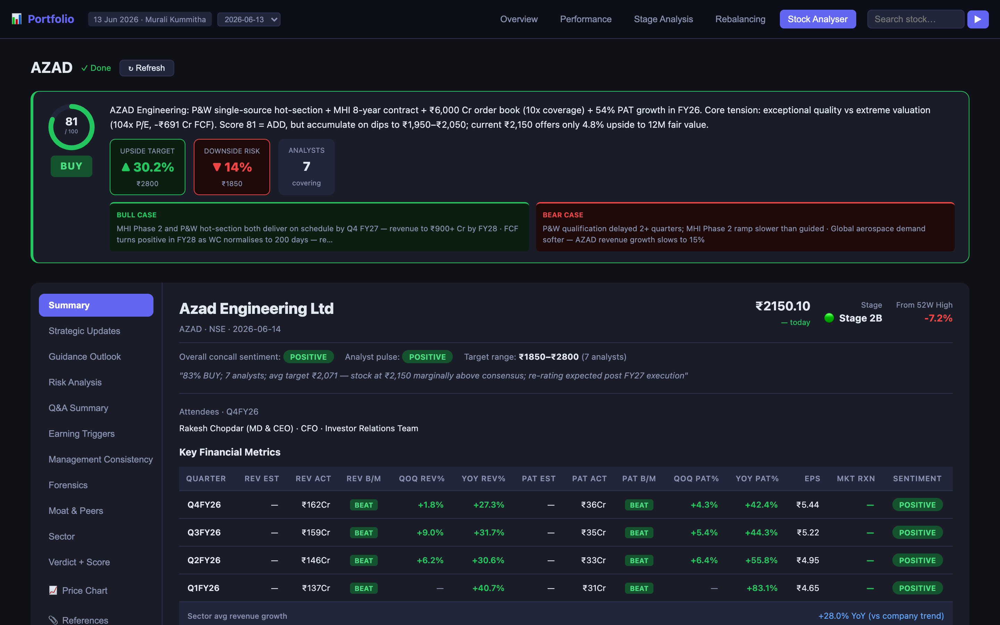
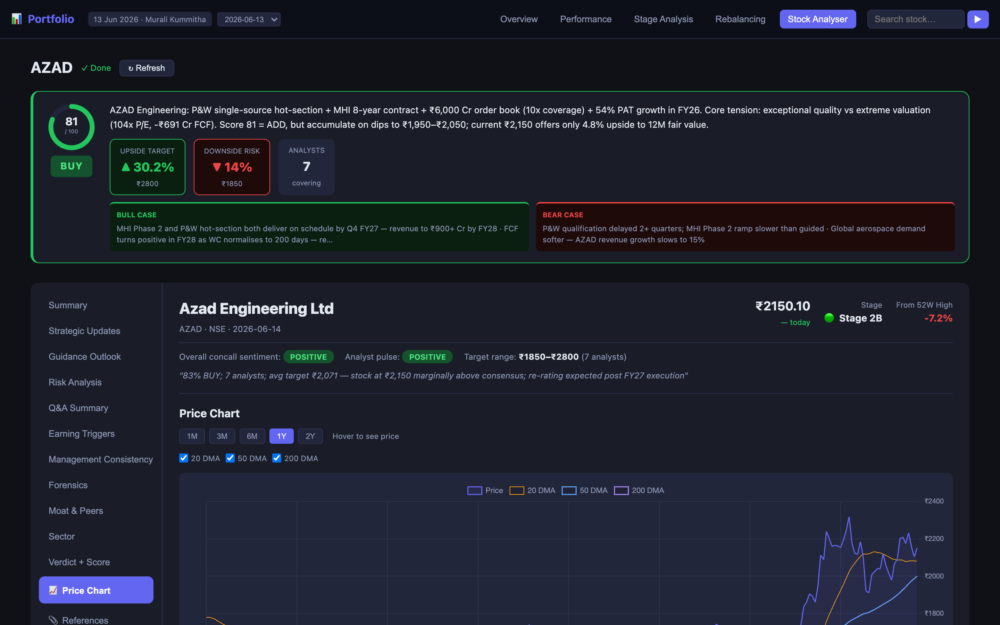
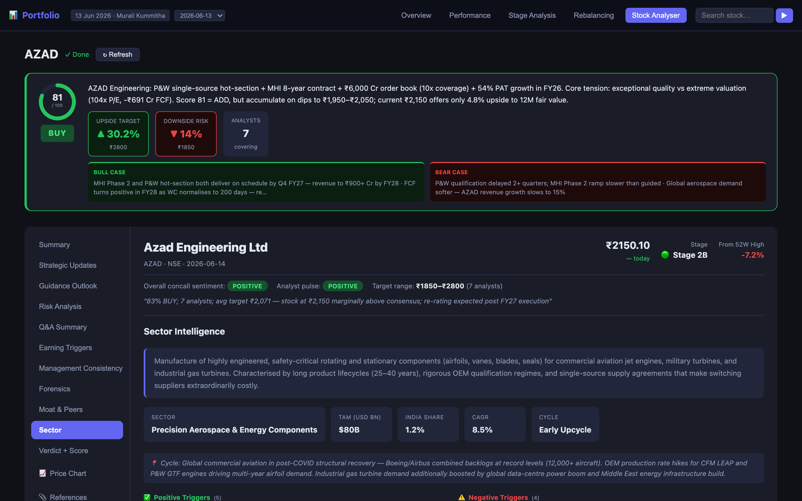
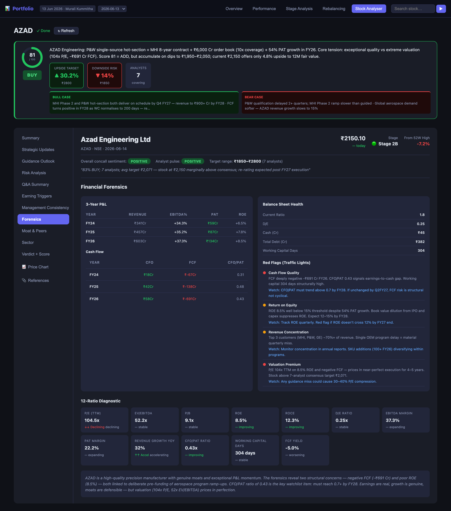
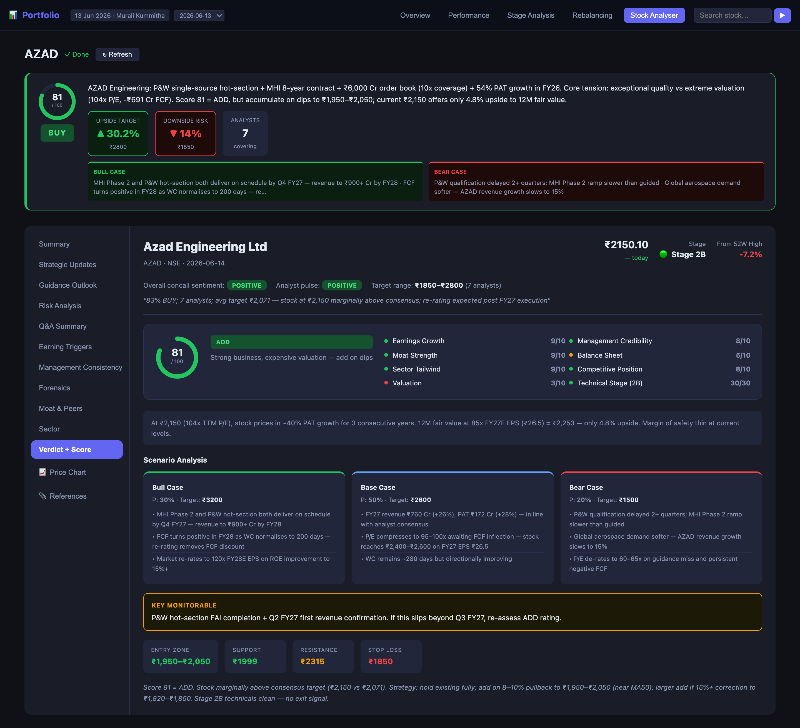
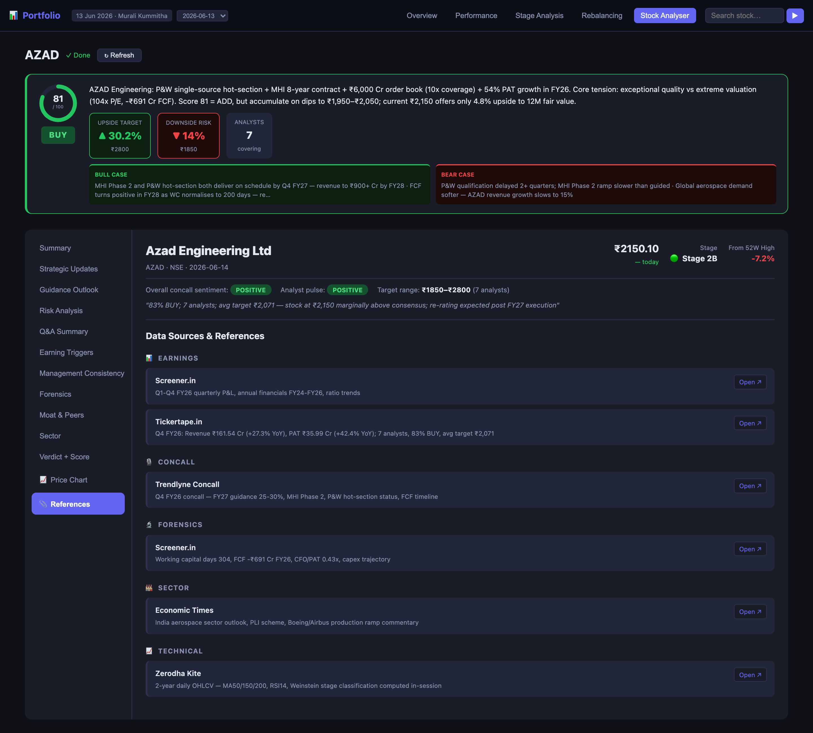

# kite-portfolio-ai

> **Institutional-grade stock analysis inside Claude Code** — connect your Zerodha Kite account and get AI-powered portfolio reviews, on-demand deep-dives, concall summaries, financial forensics, and interactive price charts. All in a self-hosted dark-mode web app.

<p align="center">
  
</p>

<p align="center">
  <a href="https://claude.ai/code"></a>
  <a href="https://modelcontextprotocol.io"></a>
  <a href="LICENSE"></a>
  
  
  
</p>

---

## What is this?

**kite-portfolio-ai** is a Claude Code skill that turns your live Zerodha Kite portfolio into an interactive research dashboard. It fetches real holdings and price data via the [Kite MCP server](https://github.com/zerodha/kite-mcp), runs AI analysis across three modules, and renders everything in a static dark-mode web app served locally.

**Two main flows:**

```
/kite-portfolio:full        → Full portfolio review (5-tab report)
/kite-portfolio:stock AZAD  → Institutional deep-dive on any NSE/BSE stock
```

No API keys. No cloud. Your data stays on your machine.

---

## Screenshots

### Verdict Banner — BUY / HOLD / SELL at a glance
Score ring, upside/downside %, bull case, bear case — rendered above every section.


### Summary — 4-Quarter Earnings with QoQ + YoY Growth
Beat/miss streak, EPS trend, QoQ and YoY columns side-by-side, key ratio tiles.



### Price Chart — Interactive 2-Year Chart with DMA Overlays
1M/3M/6M/1Y/2Y range selector · toggleable 20/50/200 DMA · volume sub-chart · hover tooltips.



### Sector Intelligence — Structured Sector Analysis
TAM, India market share, cycle position, positive and negative triggers with impact ratings, company positioning, watchlist metrics.



### Financial Forensics — 3-Year P&L, Cash Flow & Red Flags
3-year P&L and cash flow tables, balance sheet health, 12-ratio diagnostic with traffic lights, forensics verdict.



### Verdict + Score — Full Bull/Base/Bear Case Breakdown
Score ring with dimension breakdown, scenario analysis with probability and target prices, price levels (entry zone, support, resistance, stop-loss).



### References — Every Source, Linked
All data sources used during analysis grouped by section (earnings, concall, forensics, sector) with direct "Open ↗" links.



---

## Features

### Portfolio Analysis (`/kite-portfolio:full`)

| Tab | What you get |
|---|---|
| **Overview** | Snapshot stat grid · priority action list · holdings table with Stage badges and action chips · allocation bars |
| **Performance** | 1M / 3M / 6M / 1Y returns vs Nifty 50, Nifty 500, Smallcap 250, Flexicap MF, Smallcap MF |
| **Stage Analysis** | Weinstein stage per stock · MA50/150/200 · per-stock concall AI summary · management credibility ⭐ |
| **Rebalancing** | 0–100 fundamental score chips (click to expand) · capital reallocation plan · portfolio health |
| **Stock Analyser** | Type any NSE/BSE ticker → full deep-dive inline, powered by the bridge server |

### Stock Analyser (`/kite-portfolio:stock TICKER`) — 11 Sections

| Section | What's inside |
|---|---|
| **Summary** | 4-quarter P&L with QoQ + YoY growth, beat/miss badges, EPS, TTM P/E, D/E, ROE, ROCE |
| **Strategic Updates** | Key corporate events with polarity chips |
| **Guidance Outlook** | Near / medium / long-term guidance items with timelines |
| **Risk Analysis** | Structured risk flags with polarity |
| **Q&A Summary** | Concall Q&A rated DIRECT / PARTIALLY DIRECT / EVASIVE |
| **Earning Triggers** | Sized triggers with timeline and HIGH/MEDIUM/LOW probability |
| **Management Consistency** | Promise vs delivery matrix, integrity grade A–D, follow-up questions |
| **Forensics** | 3-year P&L + cash flow + balance sheet + 12-ratio dashboard + red flags |
| **Moat & Peers** | Moat radar (6 dimensions, 0–3 scale), peer comparison table |
| **Sector** | TAM, CAGR, India share, cycle position, structured triggers, watchlist metrics |
| **Verdict + Score** | BUY/HOLD/SELL, score ring, bull/base/bear cases, price levels |
| **📈 Price Chart** | Interactive 2Y chart with 20/50/200 DMA overlays, range buttons, volume bars |
| **📎 References** | All source URLs used during analysis, grouped by section |

### Scoring Rubric (0–100)

```
Business Quality (0–40)
  A. Earnings Growth      0–10   PAT YoY trend — accelerating / stable / declining
  B. Management           0–10   Concall quality, guidance delivery, promoter holding
  C. Moat Strength        0–10   Pricing power, switching costs, IP, market position
  D. Balance Sheet        0–10   D/E, FCF, ROE vs 15% threshold

Macro / Micro (0–30)
  E. Sector Tailwind      0–10   Policy cycle, industry upcycle / downcycle
  F. Competitive Position 0–10   Market share gaining / stable / losing
  G. Valuation            0–10   P/E vs 3Y historical avg — cheap / fair / expensive

Technical Stage (0–30)
  H. Weinstein Stage      0–30   Stage 2B=30 · 2A=25 · 1=15 · 3=8 · 4=0

Score → Action
  85–100  STRONG ADD     70–84  ADD          55–69  STRONG HOLD
  40–54   HOLD           30–39  WATCH        15–29  TRIM         0–14  EXIT
```

---

## Quick Start

### 1. Prerequisites

| Requirement | Notes |
|---|---|
| **Zerodha Kite account** | Any account with CNC holdings |
| **Claude Code** | [claude.ai/code](https://claude.ai/code) |
| **Node.js ≥ 18** | For the bridge server |
| **Kite MCP server** | See setup below |

### 2. Install the Kite MCP server

**Claude Code** — add to `~/.claude/mcp.json`:
```json
{
  "mcpServers": {
    "kite": {
      "command": "npx",
      "args": ["-y", "@zerodha/kite-mcp"]
    }
  }
}
```

**Cursor** — add to `.cursor/mcp.json`:
```json
{
  "mcpServers": {
    "kite": { "command": "npx", "args": ["-y", "@zerodha/kite-mcp"] }
  }
}
```

**VS Code (Copilot)** — add to `.vscode/mcp.json`:
```json
{
  "servers": {
    "kite": { "type": "stdio", "command": "npx", "args": ["-y", "@zerodha/kite-mcp"] }
  }
}
```

### 3. Clone and install the skill

```bash
git clone https://github.com/YOUR_USERNAME/kite-portfolio-ai.git
cd kite-portfolio-ai

# Install the Claude Code skill
cp -r claude-skill ~/.claude/skills/kite-portfolio
```

### 4. Start the bridge server

The bridge server runs on port 7891 and serves the report UI, stock JSON data, and enables Tab 5 interactivity.

```bash
cd portfolio-bridge
npm install
npm start
```

Then open: **http://localhost:7891/report**

> **Why do I need the bridge?** Browsers block `fetch()` from `file://` to `localhost` (CORS null-origin restriction). The bridge serves the report at `http://localhost:7891` so all API calls are same-origin and work. All 4 portfolio tabs work without the bridge — only the Stock Analyser tab requires it.

### 5. Run your first analysis

```
# Full portfolio report
/kite-portfolio:full

# Deep-dive on a specific stock
/kite-portfolio:stock AZAD
/kite-portfolio:stock HDFCBANK
/kite-portfolio:stock TATAELXSI
```

On first run, Claude will show a Kite login link. Click it, authenticate in your browser, then say `continue`.

After analysis, open: **http://localhost:7891/report/stock/AZAD**

---

## How it works

### Portfolio analysis flow

```
/kite-portfolio:full

Claude Code (main session)
  ├── mcp__kite__login()                   ← authenticate (if needed)
  ├── mcp__kite__get_holdings()            ← live portfolio
  ├── mcp__kite__get_historical_data() ×N  ← 2Y daily candles per stock  ┐ parallel
  └── WebSearch() ×N                       ← concall + earnings data      ┘

  Module 1 — Performance
    Compute returns at 1M/3M/6M/1Y vs Nifty 50/500/Smallcap + MF benchmarks

  Module 2 — Stage + Fundamentals
    MA50/150/200 + slope → Weinstein Stage 1/2/3/4
    0–100 score per stock (earnings · mgmt · moat · balance sheet · sector · valuation)
    Concall AI summary per stock

  Writes → ~/.portfolio/data/portfolio-YYYY-MM-DD.json  (~15–20 KB, ~2,500 tokens)

Browser: http://localhost:7891/report
  └── GET /data/latest → renders all 5 tabs client-side from JSON
```

### Stock deep-dive flow

```
/kite-portfolio:stock AZAD

Claude Code (main session)
  ├── mcp__kite__search_instruments()    ← resolve ticker to token
  ├── mcp__kite__get_historical_data()   ← 2Y daily OHLCV candles
  ├── Python inline                      ← compute MA20/50/150/200, RSI14, stage, slope
  └── Agent (subagent)                   ← 6 parallel WebSearches
        earnings · concall · moat · balance sheet · sector · valuation
        → structured JSON (schema v3.0)

  Python patch                           ← inject candles + compute QoQ growth
  Writes → ~/.portfolio/stock-reports/AZAD/latest.json  (~78 KB with candles)

Browser: http://localhost:7891/report/stock/AZAD
  └── GET /stock/AZAD → renders all 13 sections + chart client-side
```

**Token cost:** ~20–30K tokens per stock deep-dive (subagent keeps web search results out of main context).

---

## Repo structure

```
kite-portfolio-ai/
├── claude-skill/
│   ├── SKILL.md              ← master orchestrator — Module 1/2/3 routing
│   ├── performance.md        ← Module 1: benchmark comparison
│   ├── stage-analysis.md     ← Module 2: Weinstein stage + 0-100 scoring
│   ├── json-output.md        ← JSON write spec, merge pattern, token budget
│   └── stock-analyser-v2.js  ← Module 3 V2 workflow script (reference)
│
├── portfolio-bridge/
│   ├── server.js             ← Express bridge (port 7891): /report, /stock/:ticker,
│   │                            /data/latest, /analyse, /stock/list
│   ├── analyse.mjs           ← V3 runner: Node process for one-shot stock analysis
│   └── package.json
│
├── report/
│   └── report.html           ← Static report UI (2,560 lines — never regenerated)
│                                Renders all tabs + 13 stock sections client-side
│
├── docs/
│   ├── portfolio-data-schema.md   ← JSON field contract (schema v3.0)
│   ├── sample-stock-data.json     ← Complete AZAD example (schema v3.0)
│   ├── prompt-library-index.md    ← 8 prompt IDs mapped to skill sections
│   ├── stage-framework.md         ← Weinstein stage reference
│   ├── mf-benchmarks.md           ← MF benchmark fund list
│   └── html-ui-standards.md       ← CSS variable reference
│
├── assets/                   ← Screenshots for README
├── examples/                 ← Sample report with dummy data
├── mcp/                      ← MCP tool definitions
└── CHANGELOG.md
```

**Runtime directories** (auto-created by bridge server, not in repo):
```
~/.portfolio/
  data/            ← portfolio JSON files (portfolio-YYYY-MM-DD.json)
  stock-reports/   ← per-stock deep-dive JSON (TICKER/latest.json)
  cache/           ← legacy 7-day cache metadata
  analyse-queue/   ← trigger files from Tab 5 → bridge
```

---

## Data sources

All web research is restricted to a trusted whitelist:

| Source | Used for |
|---|---|
| `screener.in` | Quarterly P&L, balance sheet, ratio history |
| `trendlyne.com` | Concall transcripts, analyst targets |
| `tickertape.in` | Analyst consensus, earnings estimates |
| `moneycontrol.com` | News, management commentary |
| `economictimes.indiatimes.com` | Sector news, corporate filings |
| `businessstandard.com` | Competitive landscape |
| `livemint.com` | Sector policy, macro context |
| `bseindia.com` | Corporate filings, exchange announcements |
| `nseindia.com` | Exchange data, OHLCV |
| `valueresearchonline.com` | Valuation ratios, peer comparison |

Red flag and governance research additionally uses: `capitalmind.in` · `valuepickr.com`

---

## Benchmarks (hardcoded tokens)

| Index | Kite `instrument_token` |
|---|---|
| NIFTY 50 | `256265` |
| NIFTY 500 | `268041` |
| NIFTY SMLCAP 250 | `267273` |

---

## Rebalancing logic

Stage is a **timing signal only** — not the primary rebalancing driver. The 0–100 fundamental score drives actions:

| Score | Action | Rule |
|---|---|---|
| 85–100 | STRONG ADD | Excellent business + technicals aligned |
| 70–84 | ADD | Strong fundamentals — add on pullbacks |
| 55–69 | STRONG HOLD | Solid business, neutral technicals |
| 40–54 | HOLD | Steady — no new buying |
| 30–39 | WATCH | Fundamentals weakening — monitor |
| 15–29 | TRIM | Earnings slowing + overvalued |
| 0–14 | EXIT | Thesis broken |

**Overrides:**
- `TRACKING` (weight ≤ 0.2%) — never EXIT based on position size alone
- `SME` (`-SM` suffix) — max action = TRIM regardless of score (liquidity risk)
- Score 70+ but Stage 4 → ADD with note "await Stage 1/2A base before adding"

---

## Supported AI tools

| Tool | Format | Location |
|---|---|---|
| **Claude Code** | SKILL.md (Anthropic format) | `claude-skill/` |
| **Cursor** | `.mdc` rules | `.cursor/rules/` |
| **GitHub Copilot** | `copilot-instructions.md` | `.github/` |
| **Any MCP client** | MCP tool definitions | `mcp/` |

---

## Contributing

PRs welcome — see [CONTRIBUTING.md](CONTRIBUTING.md).

Areas where help is especially welcome:
- Additional benchmark indices (Midcap 150, BSE 500, sector ETFs)
- New concall / forensics data sources
- BSE SME / NSE Emerge support
- More chart types (candlestick, relative strength vs index)
- New AI tool integrations (Amazon Q, Gemini, OpenAI)

**When updating skill files:**
1. Update `CHANGELOG.md` under `[Unreleased]`
2. Run `/kite-portfolio:stock` with a real ticker and take fresh screenshots
3. Save to `assets/` and update this README

---

## Disclaimer

⚠️ **For informational purposes only. Not financial advice. All investment decisions are your sole responsibility. Past performance does not indicate future results. Use at your own risk.**

This tool connects to your Zerodha Kite account in **read-only mode** — it cannot place, modify, or cancel orders. Never share API credentials or session tokens.

---

## License

MIT © 2026 — see [LICENSE](LICENSE)
